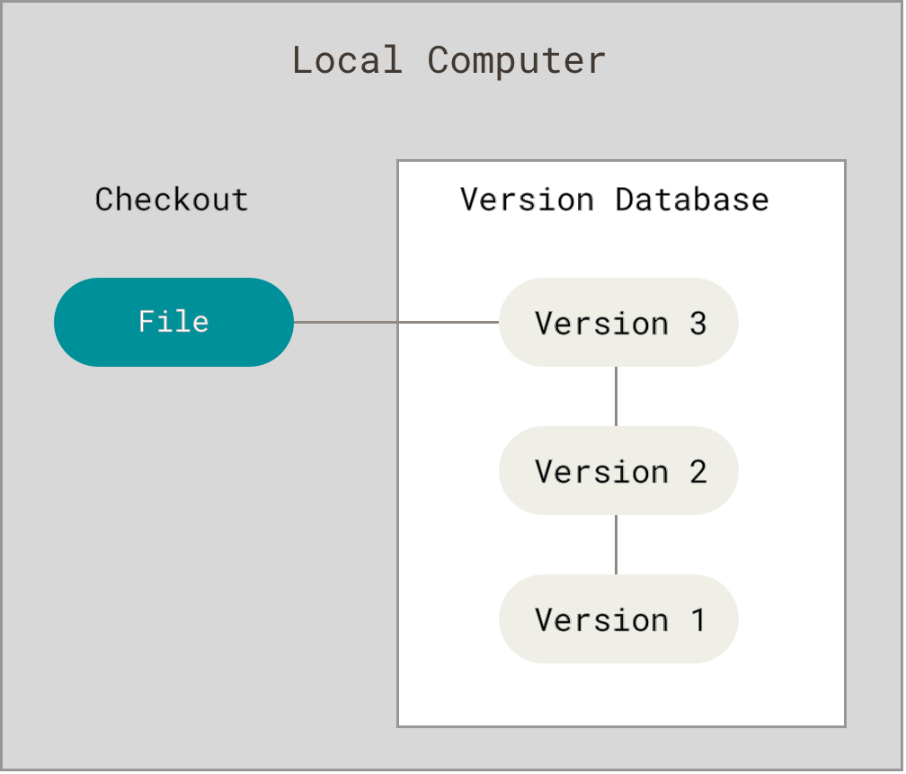
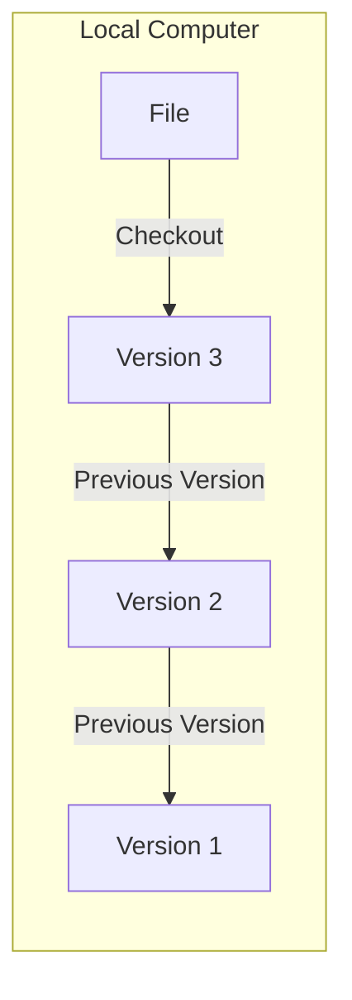
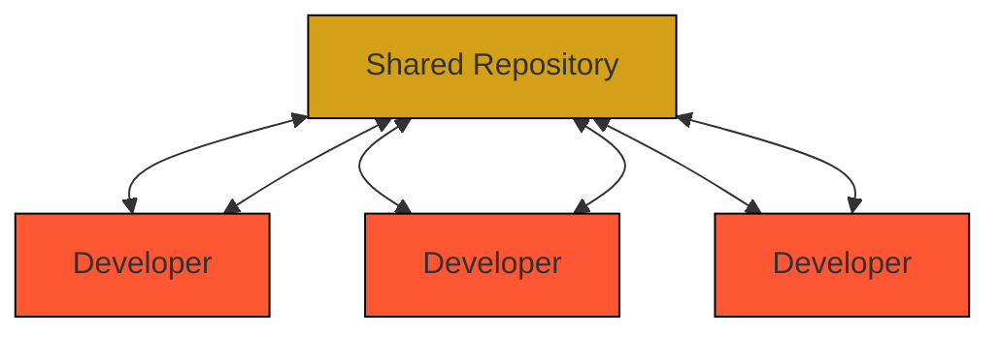

# **The Evolution of Version Control Systems**
--- 
## Local Version Control Systems
Many developers' initial approach to version control was simply copying files into another directory (perhaps with timestamps if they were being methodical). This simple but error-prone method highlighted the need for more robust version control systems.

<!---->

 
### Early VCS Solutions
 
#### SCCS (Source Code Control System)
SCCS was one of the pioneering version control systems, designed to track changes in source code and text files during software development. It introduced several key innovations:

* Embedded version tracking through unique sccsid strings that automatically updated with each revision
* Centralized storage to reduce duplicate file storage
* Systematic change tracking and logging

Key problems SCCS addressed:
* Reduced storage overhead from repeated source code versions
* Improved tracking of when and where changes occurred

 

#### RCS (Revision Control System)
RCS brought significant improvements to local version control through:

* Enhanced user interface for better usability
* Innovative storage approach using reverse differences
* Efficient retrieval of recent versions through smart delta storage
* Built-in support for file merging

RCS improved performance by storing complete copies of the most recent version and maintaining reverse differences for previous versions. This approach made retrieving current versions extremely fast while still maintaining historical data efficiently.

---

## Centralized Version Control Systems
As development teams grew and collaboration became more important, Centralized Version Control Systems emerged as a solution for multi-developer environments.

### Key characteristics
* Single server containing all versioned files
* Multiple clients checking out files from central location
* Sequential version numbering
* Standardized collaboration workflows

This model served as the industry standard for many years, with systems like SVN and CVS leading the way.

---

## Distributed Version Control Systems (DVCS)
Modern DVCS platforms like Git revolutionized version control by eliminating the limitations of centralized systems.

Key features:
* Full repository mirroring instead of simple checkouts
* Complete local history on every developer's machine
* Enhanced offline capabilities
* Superior branching and merging support

---
### Git's Unique Approach
While most other systems (CVS, Subversion, Perforce, etc.!) store information as file-based changes using delta-based version control, Git takes a fundamentally different approach:

* Stores data as a stream of snapshots
* Each commit captures the state of all tracked files
* Unchanged files are stored as links to previous versions
* Cryptographic hashing ensures data integrity
* Branching and merging as core operations

### Advantages of Git's Design
* Better performance for most operations
* True distributed architecture eliminating single points of failure
* Enhanced data integrity through SHA-1 hashing
* Flexible workflow support
* Robust branching and merging capabilities
* Extensive ecosystem and tooling support

---

## Version Control Evolution Timeline
 

